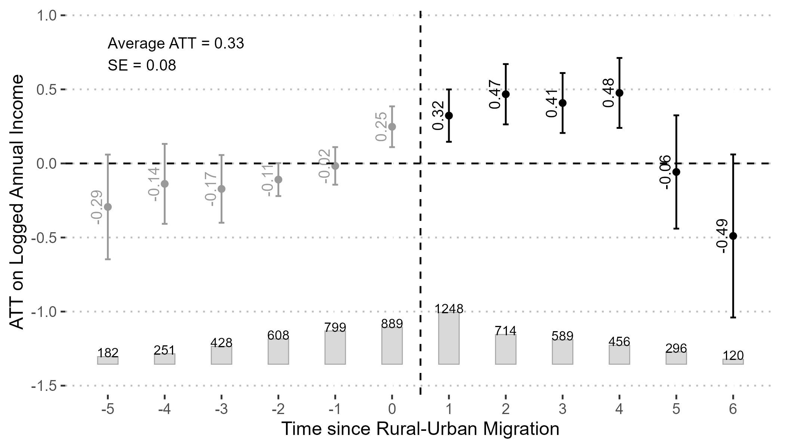

[← Back to Research](/research.qmd)

{fig-alt="Event-study plot of the dynamic effect of rural-urban migration on logged annual income" fig-align="center"}

**MPhil thesis, Chapter 3** — from *When a Nation Moves to Opportunity: Two Essays on Rural Population, Rural-Urban Migration and Income Inequality in Post-Reform China*

Rural-urban migration has reshaped China's population and labour force, but the size and durability of the income gains it brings migrants are less settled than commonly assumed. This chapter estimates them directly.

Using longitudinal data from the China Family Panel Studies and a fixed-effects counterfactual estimator, I estimate a substantial positive income return to rural-urban migration of approximately 40%, persisting for six years after migration. The effect is similar across gender, with suggestive evidence of stronger effects among high-school-educated migrants. I further find suggestive evidence that the transition from agricultural to non-agricultural employment accounts for about one-fifth of this effect — pointing to sectoral change, rather than the rural-urban move itself, as an important part of the mechanism.

Together with the population-level analysis in the [companion chapter](/research/rural-urban-inequality.qmd), the results highlight the rural population and its mobility as a central, and understudied, force behind income inequality and mobility in post-reform China.

[Read the companion chapter: Bringing the Rural Population Back In →](/research/rural-urban-inequality.qmd)

[Download the full thesis (PDF)](../files/research_text/MigrationInequality.pdf)
