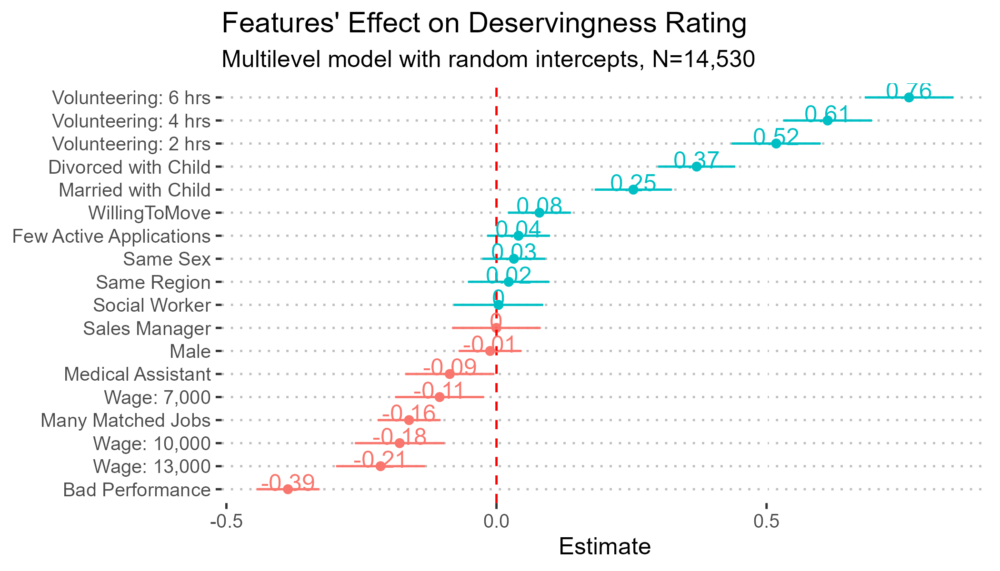

[← Back to Research](/research.qmd)

{fig-alt="Coefficient plot of vignette features' effects on welfare deservingness ratings" fig-align="center"}

**Working paper**

Public support for redistribution depends heavily on who is seen as "deserving" of help. This project uses a factorial vignette experiment — presenting respondents with hypothetical welfare claimants who vary systematically in their circumstances — to test which principles actually drive deservingness judgements, and whether exposure to information about inequality changes those judgements.

The vignette dimensions map onto the CARIN framework: **C**ontrol, **A**ttitude, **R**eciprocity, **I**dentity, and **N**eed. Across roughly 14,500 vignette ratings, volunteering — a marker of Reciprocity — is the strongest predictor of perceived deservingness, with effects that rise monotonically with hours volunteered. The reason for job loss (Control) and household income (Need) are the next most important features: people are judged as less deserving when their unemployment stems from poor performance rather than bad luck, and as less deserving the higher their prior income. Marital and parental status also matter, while Attitude and Identity features (willingness to relocate, shared gender or region with the respondent) carry little weight.

A second set of models tests whether these judgement principles shift when respondents are given information about the extent of inequality. They do not: all interactions between vignette features and the information treatment are statistically indistinguishable from zero, and an ex-post power analysis confirms the design was well powered to detect even small effects. Respondents' general attitudes toward redistribution (measured via the CARIN scale) do vary by household income, hukou status, and labour market status — but their moment-to-moment judgements about specific cases appear to follow fairly stable principles that information alone does not move.

[Download the manuscript (DOCX)](../files/research_text/Resdistribution.docx)
