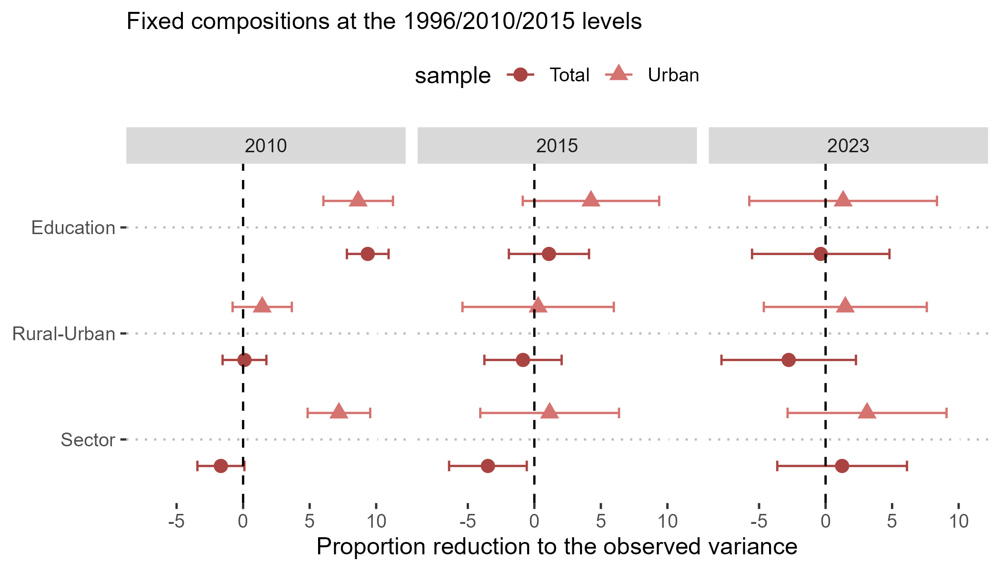

[← Back to Research](/research.qmd)

{fig-alt="Coefficient plot showing counterfactual variance reduction from education, rural-urban status, and sector composition" fig-align="center"}

**MPhil thesis, Chapter 2** — from *When a Nation Moves to Opportunity: Two Essays on Rural Population, Rural-Urban Migration and Income Inequality in Post-Reform China*

Existing research on income inequality in China focuses almost entirely on the urban labour market, leaving the rural population — and the transformations it has undergone — largely unexamined. This chapter asks how much that omission matters.

Using nationally representative survey data spanning 1996 to 2023, together with a counterfactual decomposition framework, I show that estimates of the level, trend, and determinants of income inequality look substantially different depending on whether the rural agricultural population is included. Once the full population is examined, the rural-urban divide and the agricultural-industrial divide emerge as among the most important structural axes of income inequality in China, and compositional change in employment sectors — driven by migration and industrialisation — had an equalising effect on income inequality between 1996 and 2015.

The findings underscore the importance of incorporating the rural agricultural population into analyses of social stratification in contemporary China, and more broadly.

[Read the companion chapter: The Labour Market Returns to Rural-Urban Migration →](/research/migration-returns.qmd)

[Download the full thesis (PDF)](../files/research_text/MigrationInequality.pdf)
