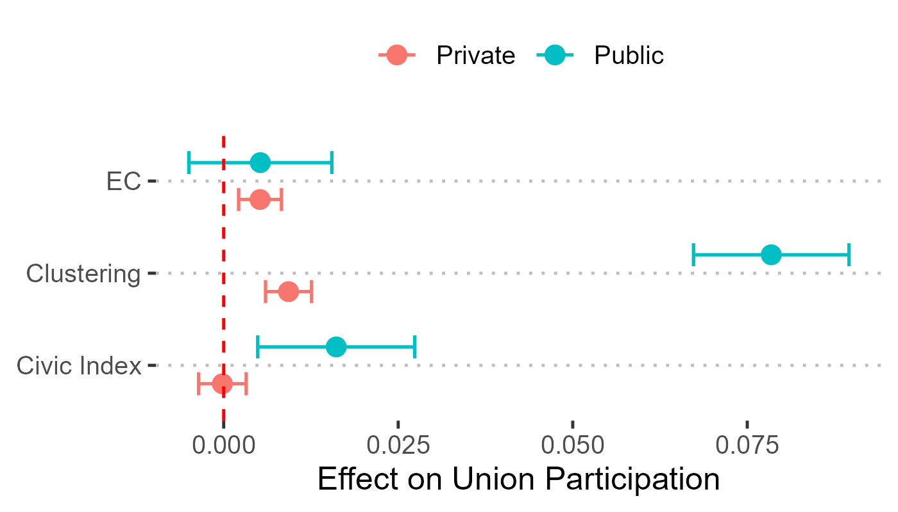

[← Back to Research](/research.qmd)

{fig-alt="Coefficient plot of features' effects, showing the association between network clustering and union outcomes" fig-align="center"}

**Article** — Revise & Resubmit, *Socio-Economic Review* (Oxford University Press)

Trade unions raise wages and compress wage inequality, but existing accounts say little about how workers actually overcome the coordination and free-rider problems inherent to collective action — especially given market and institutional barriers. This project asks what makes union collective action feasible in the first place.

I conceptualise unionisation and bargaining as collective action processes embedded in local social structure, using the concept of social capital to describe three distinct features of civil society that may enable them: *economic connectedness* (access to external resources and cross-cutting ties), *network clustering* (social closures that facilitate cooperation and diffusion), and *civic engagement* (norms and prevalence of civic participation). Rather than relying on conventional survey proxies, the study links a novel dataset of county-level social capital measures — derived from the Facebook friendship networks of millions of users (Chetty et al., 2022) — to individual-level data from the Current Population Survey, 2013–2019.

Multilevel models show that higher levels of network clustering are consistently associated with a higher probability of union participation and a stronger union wage effect: a one standard deviation increase in a county's network clustering is associated with a 2.3 percentage point increase in workers' probability of union participation and a 2% increase in the union wage premium. This association is stronger in counties with higher civic engagement, while evidence for economic connectedness is weaker and less consistent.

The study suggests that understanding the decline and persistence of unions — and their consequences for labour market outcomes — requires attention not only to institutional and market conditions, but also to the local social structure that makes labour organisation and activism feasible.

**Keywords:** trade unions, social capital, collective bargaining, labor markets

[Download the manuscript (PDF)](../files/research_text/SocialCapital.pdf)
